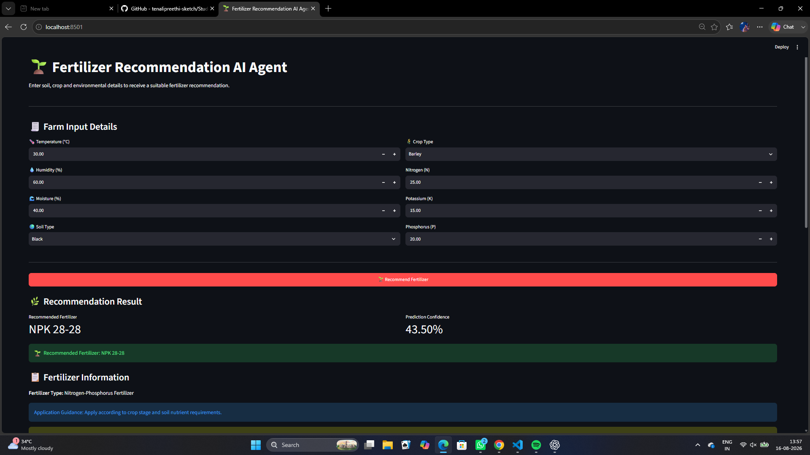
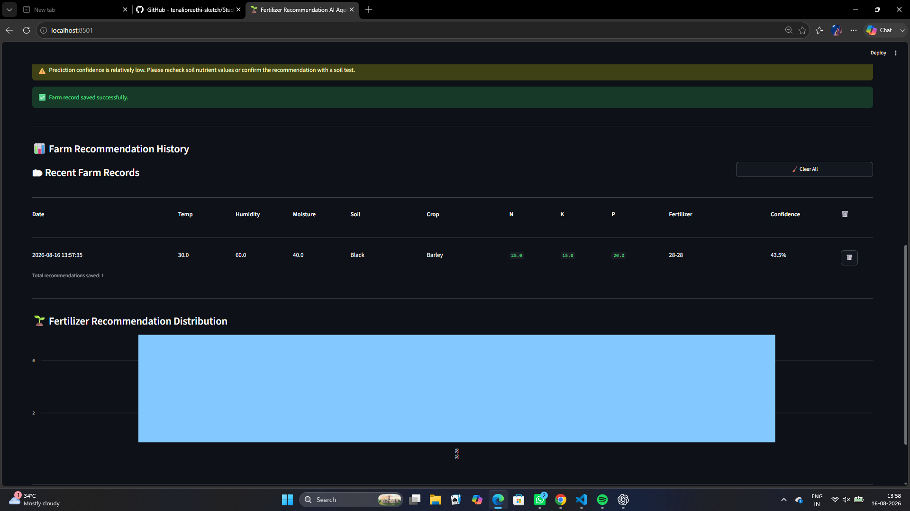

# 🌱 Fertilizer Recommendation AI Agent

A Machine Learning based AI Agent that recommends a suitable fertilizer based on soil conditions, crop type, environmental conditions, and nutrient levels.

The application provides fertilizer recommendations along with prediction confidence and maintains a history of previous farm recommendations.

## 🚀 Live Application

👉 [Open Fertilizer Recommendation AI Agent](https://fertilizerrecommendationagent-zejybfmckevyjuvp42y67m.streamlit.app/)

## ✨ Features

- 🌱 AI-based fertilizer recommendation
- 🌾 Multiple crop types supported
- 🌍 Multiple soil types supported
- 🧪 NPK nutrient analysis
- 🌡️ Temperature, humidity and moisture based prediction
- 📊 Prediction confidence score
- 📋 Fertilizer information and application guidance
- ⚠️ Low-confidence prediction warning
- 💾 Automatic farm record history
- 🗑️ Individual farm record deletion
- 🧹 Clear complete history option
- 📈 Fertilizer recommendation distribution graph
- 🌐 Interactive Streamlit web application

## 📥 Input Parameters

The AI Agent uses the following inputs:

- Temperature (°C)
- Humidity (%)
- Moisture (%)
- Soil Type
- Crop Type
- Nitrogen (N)
- Potassium (K)
- Phosphorus (P)

## 🌍 Supported Soil Types

- Black
- Clayey
- Loamy
- Red
- Sandy

## 🌾 Supported Crops

- Barley
- Cotton
- Ground Nuts
- Maize
- Millets
- Oil Seeds
- Paddy
- Pulses
- Sugarcane
- Tobacco
- Wheat

## 🧪 Fertilizer Recommendations

The model can recommend:

- Urea
- DAP
- 28-28
- 20-20
- 17-17-17
- 14-35-14
- 10-26-26

## 🛠️ Technologies Used

- Python
- Pandas
- NumPy
- Scikit-learn
- Joblib
- Streamlit
- Matplotlib
- Machine Learning

## 📁 Project Structure

```text
Fertilizer_Recommendation_Agent/
│
├── data/
│   └── Fertilizer Prediction.csv
│
├── models/
│   ├── fertilizer_model.pkl
│   ├── soil_encoder.pkl
│   ├── crop_encoder.pkl
│   ├── fertilizer_encoder.pkl
│   └── scaler.pkl
│
├── records/
│
├── reports/
│
├── screenshots/
│   ├── prediction.png
│   └── history.png
│
├── app.py
├── phase2_agent.py
├── requirements.txt
├── .gitignore
└── README.md
```

## 🧠 How It Works

1. User enters farm and environmental information.
2. Soil type and crop type are encoded for the ML model.
3. Input features are processed using the trained preprocessing components.
4. The trained Machine Learning model predicts the fertilizer.
5. The application displays the recommended fertilizer and confidence score.
6. The recommendation is stored in the farm history.

## 💻 Run Locally

Clone the repository:

```bash
git clone https://github.com/tenalipreethi-sketch/Fertilizer_Recommendation_Agent.git
```

Open the project directory:

```bash
cd Fertilizer_Recommendation_Agent
```

Install dependencies:

```bash
pip install -r requirements.txt
```

Run the Streamlit application:

```bash
streamlit run app.py
```

## 📸 Application Screenshots

### 🌱 Fertilizer Recommendation



### 📊 Farm Recommendation History



## 🎯 Project Objective

The objective of this project is to build an intelligent decision-support system that uses Machine Learning to recommend fertilizers based on crop, soil, environmental conditions, and nutrient information.

## 👩‍💻 Developed By

**Preethi Tenali**

B.Tech – Computer Science and Data Science